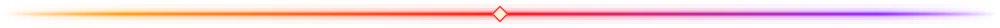

  
    
  

### ▸ ABOUT ME

Hey, I'm **Aaron**, 28, living in **Cologne**. I study **marketing** and am a working student at **REWE Group**.
After hours I build things that run on my own hardware.

- 🎓 **Marketing student** with a focus on **performance marketing**: campaigns, data and what actually makes people buy, online and in store
- 🤖 **AI enthusiast**: I run my own assistant, *Luna*, locally instead of in someone else's cloud
- 🔐 **Digital sovereignty**: own your data, own your infrastructure, avoid lock-in
- 🏠 **Homelab & self-hosting**: Raspberry Pi 5, k3s, GitOps, Tailscale

### ▸ NOW BUILDING

<table>
<tr>
<td width="33%" valign="top">

**🌙 Luna + Homelab** 
LOCAL AI · SELF-HOSTED

My own AI assistant on hardware I own. A Raspberry Pi 5 running k3s, deployed via GitOps with Argo CD, reachable only through Tailscale.

<!-- add repo link when public -->
</td>
<td width="33%" valign="top">

**🐔 Rigobert** 
ESP32 · FIRMWARE

An ESP32 that opens and closes the chicken coop on schedule. ESP-IDF firmware in C, a small web UI and tests that run the real firmware in QEMU. Built together with my brother.

<!-- add repo link when public -->
</td>
<td width="33%" valign="top">

**💒 WeddingKids** 
PWA · IN PRODUCTION

Built for **WeddingKids**, a team that looks after children at weddings, to make running their business easier than before: bookings, staff scheduling, availability polls and push notifications in one app. React + TypeScript PWA with an Express/SQLite backend.

<!-- add repo link when public -->
</td>
</tr>
</table>

### ▸ TOOLKIT

  
  
  
  
  
  
  

  
  
  
  
  

  
  
  

  MADE IN COLOGNE · 50°56′29″N 6°57′30″E · INSERT COIN TO CONTINUE

